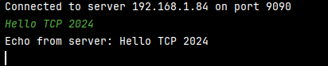

<p align="center">  </p>

### Authors : David GAMIETTE, Aurélien ZART

# UDP/TCP Chat App with Java sockets
## UDP
### [`UDP Client`(src/ensea/rts/udp/UDPClient.java)]

We want to create a `UDPClient` class that reads the text lines entered by the user from the standard input and sends them, encoded in ”UTF_8”, in a UDP datagram to the server specified in the argument on the command line.

```java
public static void main(String[] args) throws IOException {
if (args.length < 2) {
System.out.println("Missing arguments \"server\" or \"port\".");
return;
}

        String serverAddress = args[0];
        int serverPort = Integer.parseInt(args[1]);

        DatagramSocket socket = new DatagramSocket();
        InetAddress serverInetAddress = InetAddress.getByName(serverAddress);

        BufferedReader userInput = new BufferedReader(new InputStreamReader(System.in));
        String inputLine;

        System.out.println("Enter text to send to the server (type 'exit' to quit):");

        while ((inputLine = userInput.readLine()) != null) {
            if ("exit".equalsIgnoreCase(inputLine)) {
                break;
            }

            byte[] buffer = inputLine.getBytes(StandardCharsets.UTF_8);
            DatagramPacket packet = new DatagramPacket(buffer, buffer.length, serverInetAddress, serverPort);
            socket.send(packet);
        }
        socket.close();
    }
```

### [`UDP Server`(src/ensea/rts/udp/UDPServer.java)]

We want to create an `UDPServer` class representing a server that expects to receive datagrams from its clients containing strings encoded in ”UTF-8”. This server simply displays on the standard output of the received string prefixed with the client’s address.

The server must have at least :
- a constructor taking as argument the listening port number of the server’s listening port number
```java
  public UDPServer(int listeningPort) {
    this.listeningPort = listeningPort;
}
```

- a default constructor (default port number)

```java
public UDPServer() {
    this.listeningPort = 70;
}
```
- a method `toString()` which returns a String describing the state of the server
```java
public String toString() {
    return "UDPServer listening on port: " + listeningPort;
}
```
- a `launch()` method which starts the server
```java
public void launch() throws IOException {
    DatagramSocket socket = new DatagramSocket(listeningPort);
    System.out.println("Server started on port: " + listeningPort);

    while (true) {
        DatagramPacket packet = new DatagramPacket(buffer, buffer.length);
        socket.receive(packet);

        String received = new String(packet.getData(), 0, packet.getLength(), StandardCharsets.UTF_8);

        InetAddress clientAddress = packet.getAddress();
        int clientPort = packet.getPort();

        System.out.println("Received from " + clientAddress + ":" + clientPort + " - " + received);
    }
}
```
- a `main(String[] args)` method which allows to start a server
```java
    public static void main(String[] args) throws IOException {
        int port = 70;
        if (args.length > 0) {
            UDPServer server = new UDPServer(port);
            server.launch();
        } else {
            UDPServer server = new UDPServer();
            server.launch();
        }
    }
```

### Communication between the Client and the Server
<p align="center">
  
  
</p>

The client sends text messages to the server using UDP datagrams, and the server receives these messages, displaying them with the client's address and port.
       
## TCP
### [`TCPClient`(src/ensea/rts/tcp/TCPClient.java)]
For the `TCPClient`, we create a `Socket` to connect to the specified server and port. The `PrintWriter` and `BufferedReader` are used to send and receive data from the server, respectively. We use a `Scanner` to read user input from the console.

### [`TCPServer`(src/ensea/rts/tcp/TCPServer.java)]

Now we want to create a `TCPServer` class that responds with an echo of the received text, preceded by the client's IP address.

We use the same model as the `UDPServer`, except that the `launch()` method.

We also define a constant `maxBytes`, which represents the maximum number of bytes we can read from the client at a time, and a `buffer` array to store the data received from the client.

When a client connects, we create a `PrintWriter` to send data back to the client and an `InputStream` to receive data from the client. We then send an echo message back to the client, which includes the received text preceded by the client's IP address.

### Communication between the Client and the Server
<p align="center">
  
  
</p>
The client establishes a connection to the server and sends text messages. The server receives these messages and responds with an echo, including the client's IP address and port.

### [`TCPMultiServer`(src/ensea/rts/tcp/TCPMultiServer.java)]
The `TCPMultiServer` class listens for incoming client connections on a specified port and handles each connection in a separate thread.

The `startServer` method creates a `ServerSocket` to listen for incoming connections on the specified port. When a client connects, the server accepts the connection and creates a new `ClientHandler` thread to handle the communication with the client.

```java
public void startServer() {
try (ServerSocket serverSocket = new ServerSocket(port)) {
System.out.println("Server started on port: " + port);

        while (true) {
            Socket clientSocket = serverSocket.accept();
            System.out.println("Client connected from " + clientSocket.getInetAddress());
            new ClientHandler(clientSocket).start();
        }
    } catch (IOException e) {
        System.err.println("Server error: " + e.getMessage());
    }
}
```

The run method of the `ClientHandler` class handles the communication with the client. It reads data from the client and sends responses back. The method uses a `PrintWriter` to send data to the client and an `InputStream` to read data from the client. If an error occurs during communication, it is caught and logged.

```java
@Override
public void run() {
    try (PrintWriter out = new PrintWriter(clientSocket.getOutputStream(), true);
         InputStream in = clientSocket.getInputStream()) {

        int bytesRead;
        while ((bytesRead = in.read(buffer, 0, maxBytes)) != -1) {
            String message = new String(buffer, 0, bytesRead);
            InetAddress clientAddress = clientSocket.getInetAddress();
            int clientPort = clientSocket.getPort();
            System.out.println("Received from " + clientAddress + ":" + clientPort + " - " + message);
            out.println(clientAddress + ": " + message);
        }
    } catch (IOException e) {
        System.err.println("Client handler error: " + e.getMessage());
    } finally {
        try {
            clientSocket.close();
        } catch (IOException e) {
            System.err.println("Error closing client socket: " + e.getMessage());
        }
    }
}
```

### Communication between the Client and the Server
Now we test the communication between the 2 Clients and the Server :

<p align="center">  </p>

We can see that the code works !
